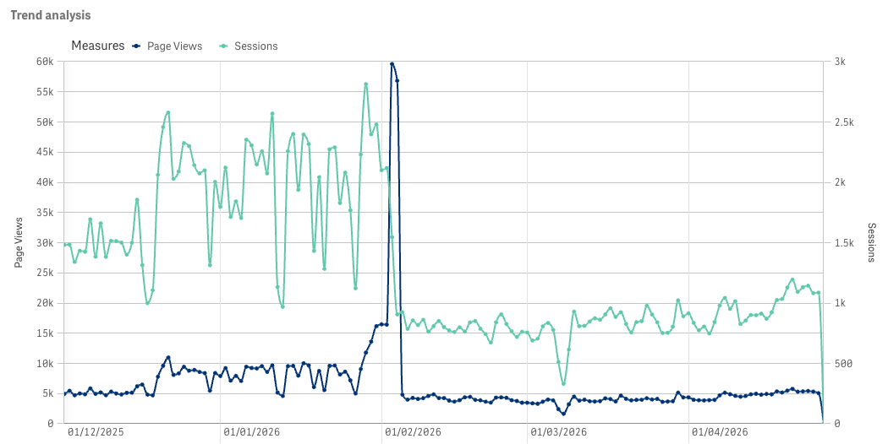

# Portfolio Project: Bot Traffic Anomaly Investigation
## When a "bot spike" turns out to be two unrelated things happening on the same day

**Role:** Analytics Engineer — large software discovery platform (~50M monthly visits)  
**Stack:** BigQuery · dbt · GA4 · bot traffic  
**Time spent:** ~1.5 hours

---

The Product team came with three observations from their dashboard, all pointing to the same two-week window in early February 2026:

1. Page_view events spiked massively around late January/early February, then collapsed
2. After the collapse, page_views stabilised — but much lower than the January baseline
3. Session_start events dropped dramatically around the same dates and never recovered



The working theory was a single root cause: a failure in the BI data pipeline. That turned out to be wrong — there were two independent events that happened to peak on the same two days, none of them being an issue on BI's side.

---

## Tracing the pipeline before touching the data

Before running a single query I traced the model lineage. `rpt__app_daily` is a view — just a campaign-name transformation on top of `mart__app_metrics`. The mart is an incremental table partitioned by date, sourced from `int__ga4_events`. 

The pipeline includes data from two different website domains: a parent website with a lot of traffic aimed at retail consumers, and a child subdomain focused on developers. The first feeds the second with traffic. Both domains are included in the same GA4 property, that's why the pipeline shares the root.

---

## First look: the data tells the story immediately

Daily totals from `mart__app_metrics`:

| Date | Page Views | Sessions | PV/Session |
|------|-----------|---------|-----------|
| Jan 10–28 (avg) | ~8,700 | ~2,100 | ~4.2 |
| Jan 30 | 13,601 | 2,398 | **5.67** |
| Jan 31 | 16,158 | 2,479 | **6.52** |
| Feb 01 | 16,473 | 2,101 | **7.84** |
| **Feb 03** | **59,600** | **1,546** | **38.55** |
| **Feb 04** | **56,840** | **906** | **62.74** |
| Feb 05 | 4,804 | 924 | 5.20 |
| Feb 10 | 4,600 | 764 | 6.02 |

Two things stand out immediately. First, the PV/session ratio was already climbing from Jan 30 — before the explosion — which means the anomaly had been building for days. Second, sessions don't spike on Feb 03–04: they actually drop. Whatever is inflating page_views is contributing zero sessions. That's the diagnostic.

A breakdown by device confirmed the spike is **100% desktop**. Mobile, tablet, and smart TV traffic is flat throughout. Whatever is happening, it is not spread across device types the way real user behaviour would be.

---

## Finding the bot

Grouping by `source`, `medium`, `page_type` on the spike days made the signal obvious. On Feb 03:

- `source=unknown, medium=unknown, page_type=home`: **52,831 page_views, 162 sessions** → PV/session = **326**

The entire spike is in one bucket. All other page types (login, dashboard, etc.) are at completely normal levels.

I went to the raw GA4 export to confirm. Filtering `GA4.events_*` for `page_type = 'home'`, null UTMs, on Feb 03:

```sql
SELECT
    geo.country,
    device.operating_system,
    device.web_info.browser,
    COUNT(*) AS pv_count,
    COUNT(DISTINCT user_pseudo_id) AS unique_users
FROM `GA4.events_*`
WHERE _TABLE_SUFFIX = '20260203'
    AND event_name = 'page_view'
    AND (SELECT value.string_value FROM UNNEST(event_params) WHERE key = 'page_type') = 'home'
    AND collected_traffic_source.manual_source IS NULL
GROUP BY 1, 2, 3
ORDER BY pv_count DESC
LIMIT 5
```

| Country | OS | Browser | PVs | Unique users |
|---------|-----|---------|-----|-------------|
| United States | Linux | Chrome | **52,508** | **52,508** |
| (everything else) | — | — | <100 each | — |

`pv_count == unique_users`. Every single page_view comes from a different `user_pseudo_id`. The bot rotates a fresh synthetic identity on each request — a standard headless scraper technique for evading deduplication. It fires `page_view` without firing `session_start`, which explains the ratio. The `null` UTMs become `unknown` in the mart via the COALESCE in the staging macro.

The ramp-up was already underway from Jan 30 (3,288 phantom PVs) through Feb 02 (7,277), before the full explosion on Feb 03–04 (~52,500/day). It stopped completely on Feb 05 — zero bot traffic.

---

## The permanent drop: a separate event entirely

Once the bot was accounted for, I looked at what determined the new baseline after Feb 05. The answer came from the `parent/homepage` source breakdown:

```sql
SELECT
    date,
    SUM(page_views) AS page_views,
    SUM(sessions) AS sessions
FROM `mart__app_metrics`
WHERE source = 'parent' AND medium = 'homepage'
GROUP BY date
ORDER BY date
```

| Date | PVs | Sessions |
|------|-----|---------|
| Jan 17 | 7,039 | 2,092 |
| Jan 29 | 8,343 | 2,483 |
| Feb 02 | 5,491 | 1,748 |
| Feb 03 | 3,612 | 1,235 |
| **Feb 04** | **1,028** | **614** |
| Feb 05 | 979 | 571 |
| Feb 15 | 937 | 555 |

**85% drop, permanent, starting Feb 04.** In January, this single channel — `utm_source=parent&utm_medium=homepage&utm_campaign=navbar` — was responsible for ~60–65% of all page_views and ~75–80% of all sessions. Its disappearance explains the entire lower plateau.

In the raw GA4 export this maps to `manual_source='parent'`, `manual_medium='homepage'`, `manual_campaign_name='navbar'` — a tracked link or widget on parent website's navbar/homepage that was funnelling consumers from the main portal into the child website. After Feb 04, it drops to ~1k/day and stays flat with no weekday variation — consistent with organic direct navigation from existing child website users, not consumer discovery from parent website.

The bot and this drop are **not causally related**. The bot inflated the `unknown/unknown` bucket; the `parent/homepage` bucket collapsed independently. They just peaked on the same two days.

---

## What I handed off

- A short summary covering both events and their independence
- A detailed `.md` document covering timeline, forensics, pipeline notes, and action items
- Published to Confluence
- Three concrete next actions, ranked by priority: (1) confirm with Product whether the child website entry point from parent's was intentionally removed, (2) optionally add a GA4 bot filter for the US/Linux/Chrome/null fingerprint, (3) decide on history patching for the spike days — with a clear BI position against pipeline patching

---

## Why I'm sharing this one

Not for the SQL — the queries are simple. What I find worth showing is two things.

First: the **discipline of not assuming a single root cause**. The data had a clean narrative that could have stopped at "bot spike → panic → cleanup → lower baseline". The actual story required holding two separate threads simultaneously and noticing that the session drop persisted after the bot vanished. That's a different kind of attention than just explaining the spike.

Second: **leveraging stong knowledge in BI tech scenario combined with non-BI tech**. It was about keeping pipeline context, business context, and data context in one place while iterating through a multi-layer investigation. The result is an analysis done in under two hours with an optimal depth of documentation and stakeholder output at the end.
