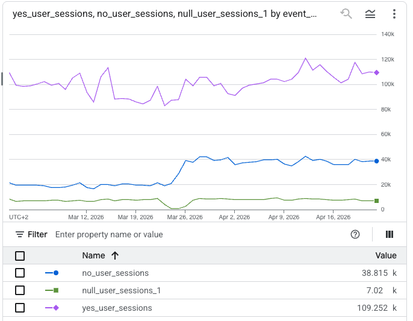

# Portfolio Project: Null Attribution Investigation
## When "the pipeline is broken" turns out to be a GDPR compliance fix

**Role:** Analytics Engineer — large software discovery platform (~50M monthly visits)  
**Stack:** BigQuery · dbt · GA4 · Consent Mode v2  
**Time spent:** ~3 hours

---

The SEO team came with a chart: `landing_page_type = NULL` sessions had jumped from ~15% to ~25% of organic traffic in EU countries, overnight, around March 25. No data pipeline release that day. Could I take a look?

They had two theories: either the CAPTCHA was somehow interfering with the tracking, or something was broken in the BI/reporting models. Both reasonable starting points. Both wrong — but for reasons that were worth understanding properly.

---

## Tracing the field upstream

The "broken BI model" hypothesis was worth checking first — it's the most fixable outcome and it costs nothing to rule out. I traced `landing_page_type` back through the dbt lineage instead of poking at the reporting table directly. The field comes from `first_page_view`, which in `mart_traffic__metrics` is sourced from the **ODCR model** (a download conversion rate model), not from the sessions model — even though the sessions model also computes that field. The reason for that design choice matters here: the sessions model includes sessions where `user_pseudo_id IS NULL`, but those sessions generate colliding session keys (GA's `ga_session_id` is a Unix timestamp — it's not unique across anonymous users). Pulling `first_page_view` from that bucket would inflate counts for whatever page type happened to be first in the merged group. So the ODCR model — which filters `user_pseudo_id IS NOT NULL` — is the source instead, and when it has no matching row, the LEFT JOIN returns NULL and the reporting layer passes it through unchecked.

```
reporting__traffic.landing_page_type
  ← mart_traffic__metrics.first_page_view   ← d.first_page_view (ODCR side of LEFT JOIN)
    ← int_ga4__odcr.first_page_view         ← filtered: user_pseudo_id IS NOT NULL
      ← int_ga4__all_events                 ← raw GA4 export
```

So the real question wasn't "why is the pipeline producing NULLs" — it was "why are more sessions missing from ODCR than before?"

---

## The data tells a clear story

I checked `user_pseudo_id IS NULL` rates in `int_ga4__all_events` for organic sessions in FR, ES, DE, IT — the exact countries the SEO team had flagged:

```sql
SELECT
  DATE_TRUNC(event_date, WEEK) AS week,
  geo.country,
  ROUND(SAFE_DIVIDE(COUNTIF(user_pseudo_id IS NULL), COUNT(*)) * 100, 2) AS pct_null
FROM `your_project.dbt_int.int_ga4__all_events`
WHERE event_name = 'session_start'
  AND manual_medium = 'organic'
  AND LOWER(geo.country) IN ('france', 'spain', 'germany', 'italy')
GROUP BY 1, 2
ORDER BY 1 DESC
```

Step-change. All four countries. Same week. France jumped from ~30% to ~44%; the others from ~8% to ~14–17%.



To close the loop between upstream and downstream I ran the equivalent query on the sessions model — sessions with `ga4_session_key LIKE 'unknown_%'` are the anonymous ones, and they matched the NULL LPT percentage in the reporting table to two decimal places across four consecutive weeks:

| Week | % anonymous keys in sessions | % NULL LPT in reporting |
|---|---|---|
| Mar 22 | 23.14% | 23.15% |
| Mar 29 | 26.80% | 26.89% |
| Apr 05 | 25.46% | 25.49% |
| Apr 12 | 24.65% | 24.62% |

That kind of correlation doesn't leave room for alternative explanations. The NULL LPT is a direct consequence of more sessions having no `user_pseudo_id`.

I also checked US, Mexico, Brazil as a control — flat across the same period. The spike was EU-specific, which pointed straight at GDPR.

---

## Ruling out the CAPTCHA

The team's CAPTCHA theory was that a page redirect could break the CMP initialisation flow, preventing the consent signal from reaching GA4. Took about two minutes to discard — the CAPTCHA is invisible, runs as background JS with no redirect. It can't interfere with anything in the consent sequence.

---

## The actual cause — and the twist

Digging into `privacy_info.analytics_storage` in the raw GA4 export (a field that records the Consent Mode state at the time of each event) showed three separate CMP changes in March, not one:

| Date | Change | Impact |
|---|---|---|
| Mar 16 | Decoupled ads consent from analytics consent | None on LPT |
| Mar 23–27 | New granular consent UI — deployed then rolled back | None on LPT |
| **Mar 25** | Permanent increase in `analytics=no` base rate | **Root cause** |

The interesting part: the granular UI was rolled back by March 27, but the higher denial rate wasn't. Something in that deployment — likely changing the CMP default from omitted/`null` to explicitly `denied` — stuck.

Here's the twist that reframed the whole thing: **the pre-March-25 state was the non-compliant one.**

GA4 Consent Mode v2 works like this — the CMP fires `gtag('consent', 'default', { analytics_storage: 'denied' })` in `<head>` *before GA4 initialises*. GA4 fires `session_start` without a `user_pseudo_id`. The consent banner then appears. If the user accepts, GA4 gets the update and starts assigning identity from that point on.

Before March 25, a lot of sessions had `analytics_storage = null` — meaning GA4 had assigned a `user_pseudo_id` to sessions where consent hadn't been established yet. That's the problem. The March 25 change, by making the default explicitly `denied`, fixed it. The analytics coverage drop is real, but it's the correct trade-off.

---

## What to do about it

The only things actually worth doing:

- **Don't touch the CMP default.** Reverting to `null` or `granted` means collecting user identity without consent. That's the thing we just fixed.
- **Improve the consent banner UX.** This is the only real lever — if more users accept, more sessions get `user_pseudo_id`, more sessions land in ODCR. Everything else is downstream of this.
- **Add a `COALESCE` in the dbt model** (`COALESCE(first_page_view, 'consent_denied')`) so analysts stop filing bug tickets about NULLs. Low priority but cheap.
- **Tell the SEO team** that their organic EU metrics now skew toward returning, previously-consented users. First-time organic visitors are increasingly untracked. That changes how you interpret acquisition data.

Cookieless pings (GA4's modelled-data feature for denied sessions) aren't worth enabling for a BigQuery-first stack — the modelled data only surfaces in the GA4 UI and never reaches the raw export.

---

## Why I'm sharing this one

Not because the SQL was clever — it wasn't. What I find worth showing is the approach: start at the broken end and trace upstream before assuming anything, distinguish "the pipeline is broken" from "the data changed", and be willing to flip the framing entirely when the evidence points somewhere unexpected. The finding here wasn't a bug to fix. It was a compliance change that looked like a regression, and the right call was to explain it clearly and leave it alone.
